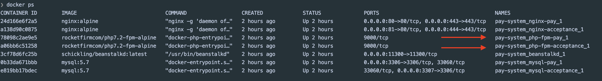

## Развернуть проект  

1. docker-compose up -d
2. зайти в php-fpm образы  

 

### pay-system-php-fpm

- `composer install`
- `php yii migrate`

### acceptance-system-php-fpm

- `composer install`
- `php yii migrate`

## Database

Базы доступны по портам 3306, 3307   
user - password  
root - root

## Process

в pay-system php fpm   
`php yii transaction/send-transaction`

в acceptance-system php fpm запустить listener очередей  
`php yii worker`